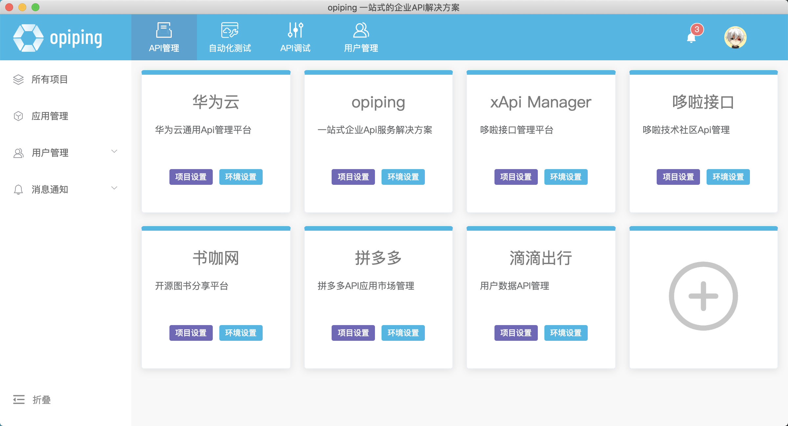
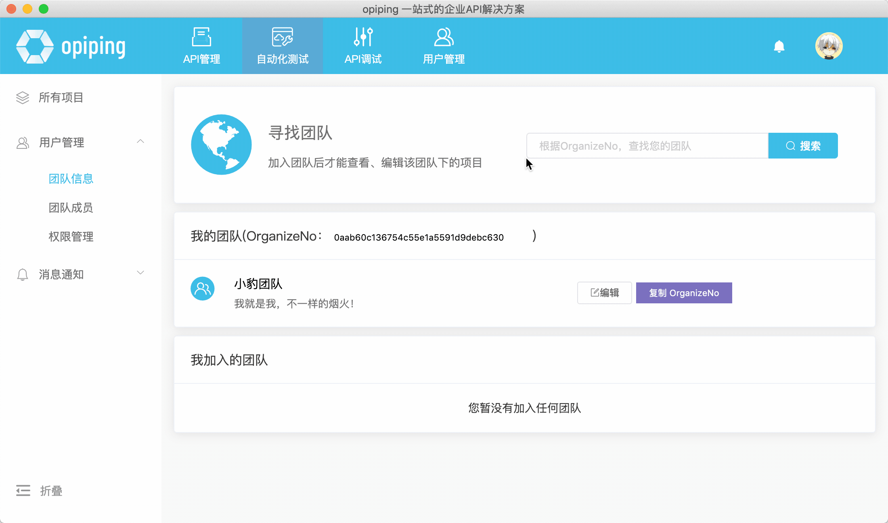
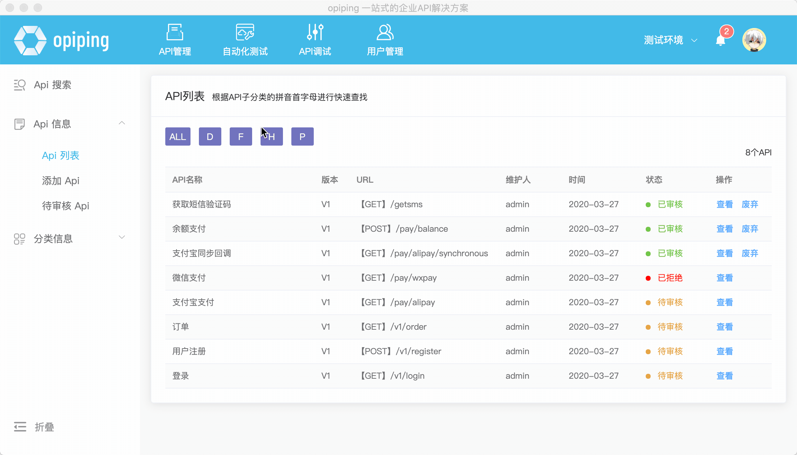
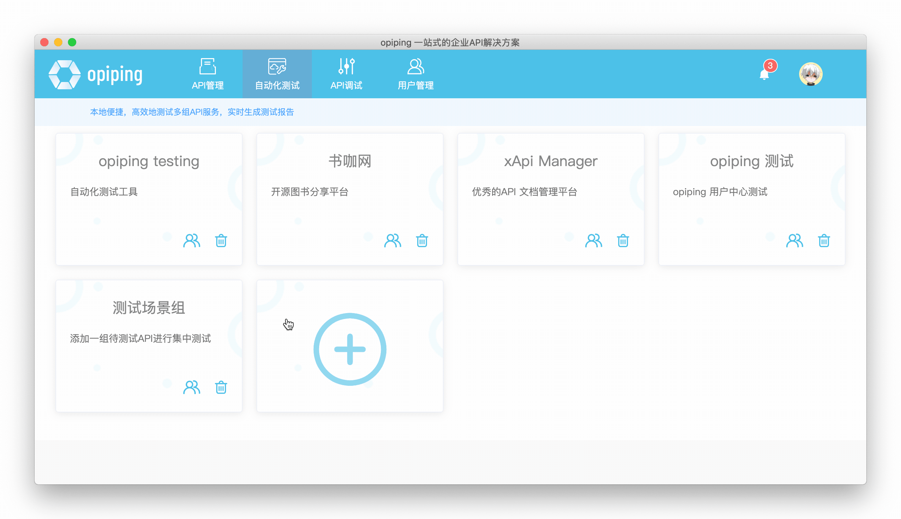
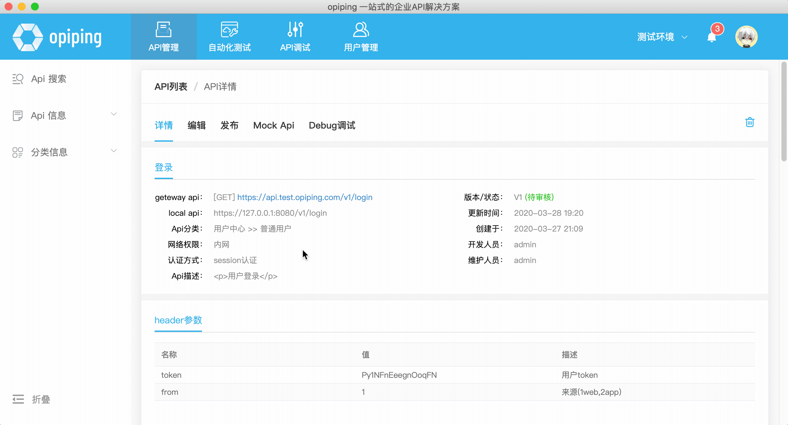
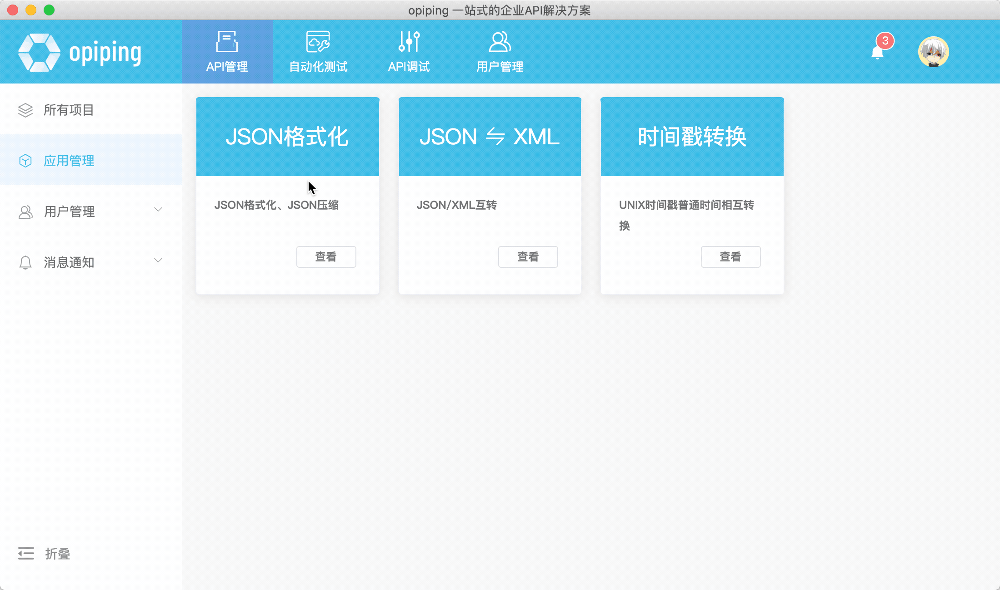

项目介绍
========

### OPIPING 一站式API解决方案
专业实用的Api解决方案，为企业提供一个灵活，方便，快捷的API管理系统，让API管理变的更加便捷、更加实用.

功能说明
1. 支持多团队、多项目、多环境，更符合技术开发和使用场景
2. 支持Api场景组并发测试、性能测试
3. 通过功能权限、数据权限让您精准的控制用户的使用权限，使其尽在掌控之中
4. 动态生成API数据，让前后端更好的协同开发，降低等待时间，提高开发效率

- 官方地址：https://xapimanager.opiping.com/
- 项目部署及配置：https://shuka.opiping.com/t/xapimanager (安装和升级请参考手册)
- Windows、Mac 客户端下载: https://www.opiping.com/

Windows、Mac客户端
========
**多项目管理** 

**多团队管理** 

**Api快速查找** 

**Api自动化测试** 

**Api Mock测试** 

**常用插件** 

